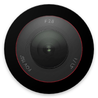
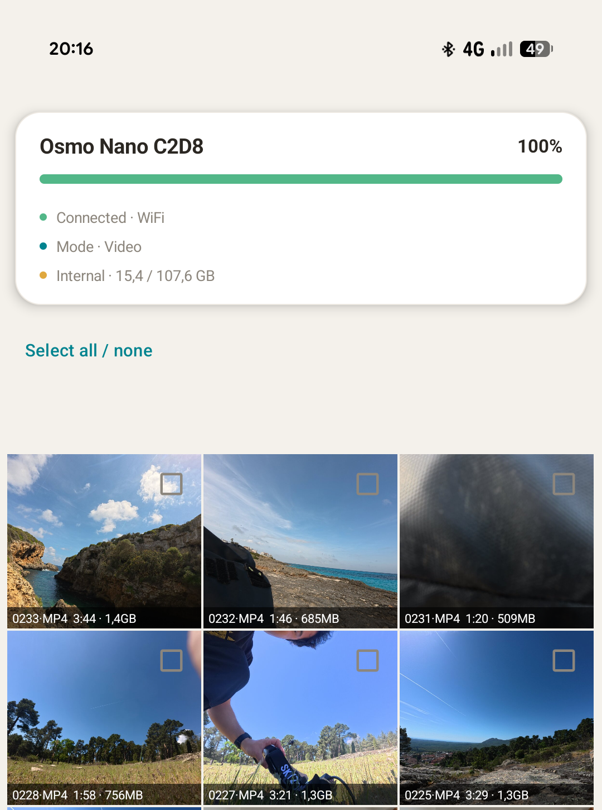
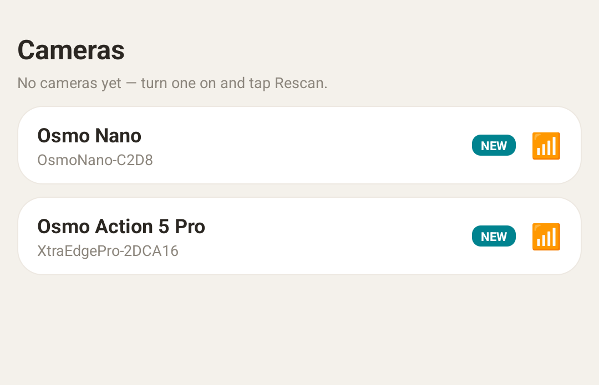

# Osmosis — Android media client for DJI Osmo cameras

<div align="center">



</div>

Third-party Android client to download videos and photos from DJI Osmo action / gimbal cameras. **No DJI SDK dependencies, no logins, no bloatware, no activation.**

<p align="center">
  
</p>

Works with the **DJI Osmo Nano**, which isn't supported by the official DJI SDK or the DJI R-SDK, and should also work with the rest of the DJI Osmo lineup (see [Supported cameras](#supported-cameras)). Also tested with the **Xtra Edge Pro**, a rebadged **DJI Osmo Action 5 Pro** made by DJI front company Xtra.

## Features

- **Media grid** with thumbnails, pulled straight off the camera.
- **Low-res streaming preview** — scrub any clip without downloading it first.
- **In-preview trimming** — set in/out points and download just that slice of the **high-res** clip. Keyframe-accurate stream copy in original quality.
- **Resumable download queue** — high-res downloads straight into your phone's gallery.
- **Live status** — battery, shooting mode, and storage (internal / SD) shown in a status pill. More to come (recording indicator, resolution, fps, etc...)
- **Multi-camera** — remembers your cameras and shows which are currently in range.
- **Favorite** your videos/photos from the app, and view previously hearted media
- **Sync GPS with your Osmo**: Uses R-SDK [Osmo GPS controller](https://github.com/dji-sdk/Osmo-GPS-Controller-Demo) commands to send GPS from the phone to your camera. Useful to add stats later using [Telemetry Overlay](https://goprotelemetryextractor.com/telemetry-overlay-gps-video-sensors).



## Planned for short term:

- Camera control: start/stop recording, take photo, change settings
- Live preview
- USB-C offload
- Support DJI drone offload via quick transfer (Neo2 specifically)

## Supported cameras

| Camera | Status |
|---|---|
| Osmo Nano | Verified on hardware |
| Osmo Action 5 Pro / Xtra Edge Pro | Verified on hardware |
| Osmo Action 6 | Verified on hardware |
| Osmo Pocket 3 | Verified on hardware |
| Osmo Pocket 4 / 4 Pro | Planned |
| Xtra Atto / Edge / Muse | Untested, should work |
| Osmo Action 1 | Started, parked |
| Osmo Action 4 | Started |
| Osmo 360 | Unplanned (needs Mimo to render 360 content) |
| Osmo Action 2/3 | Best-effort default, untested, not expected to work |
| DJI drones using quick transfer | In progress |

Want to help adding support for an unsupported camera? [Open an issue](../../issues) so it can be listed as fully supported.

**Xtra rebadges.** Xtra is a [DJI front company that sells rebadged Osmo cameras US-only to sidestep the DJI ban](https://github.com/KonradIT/dji-front-companies):

- **Edge Pro** = Action 5 Pro
- **Atto** = Nano
- **Edge** = Action 4
- **Muse** = Pocket 3.

Actively trying to support, raise an issue if you have these cams and would like to help:

- Osmo Pocket 4/4P
- Osmo Action 4
- Osmo Action 3.

## Debugging / supporting new cameras:

Start the app, enable Save Logs, try and connect to the camera, anything that is being sent and received is being logged to an internal location only accessible by the app. Tap Save Logs again to disable the logging + gzip it to share it with me.

## Reverse engineered command list:

If you want to build your own app or program that interfaces with DJI Osmo cameras, this document will help:

[./MEDIA_PROTOCOL.md](./MEDIA_PROTOCOL.md)

This is the most extensive documentation of DJI's undocumented DUML protocol for Osmo cameras to date. It is derived using DJI Mimo wifi/ble captures.

Covers both BLE/WiFi transport routes.

Commands reverse engineered not found anywhere else:

- Parsing media list 0x26 and it's response 0x00/0x27
- Pagination for querying older media
- Highlights, delete file

## How it works

No DJI SDK — Osmosis speaks DJI's **DUML** protocol directly. Each session:

1. **BLE pair** with the camera (requires approving on the camera itself once).
2. **Read the WiFi credentials over BLE** (SSID + passphrase).
3. **Wake and join** the camera's WiFi access point.
4. **List the media** via the DUML file-list command over UDP.
5. **Download** the high-res files over HTTP from the camera's `192.168.2.1` server.

The full reverse-engineered protocol — BLE pairing, WiFi handoff, the DUML file-list format, and more — is documented in [docs/01-protocol-map.md](docs/01-protocol-map.md).

## Privacy

Osmosis talks to **only your camera** (`192.168.2.1`). No analytics, no accounts, no activation servers, no cloud. Your media never leaves your phone and camera.

Contrast the official apps, which require a login and phone home to activation and telemetry backends (the Xtra companion app even bundles ByteDance analytics). Osmosis has none of that — the network security config restricts it to the camera's local address.

## Requirements

- **Android 10+** (API 29).
- **Bluetooth LE**.
- Permissions: Nearby devices (Bluetooth scan/connect) on Android 12+, or Location on older versions, plus WiFi state/change. No internet permission is needed for anything but the camera's local AP.

## Getting started

1. Turn on Bluetooth and WiFi, and open Osmosis; grant the permission prompts.
2. Power on the camera and tap it in the **Cameras** list. Should show as "NEW".
3. **Approve the pairing prompt on the camera screen** (will read: `OSMO`).
4. **Approve the Android "join WiFi" dialog** when it appears.
5. Browse the grid. Tap a clip to preview, trim, and add it to the queue.
6. Tap **Download** — files land in your phone's gallery.

## Download

- Play Store:
- GitHub releases: https://github.com/KonradIT/osmosis/releases
- Unobtanium: https://apps.obtainium.imranr.dev/redirect?r=obtainium://add/https://github.com/KonradIT/osmosis
- F-Droid:

## Build from source

Standard Gradle Android build:

```sh
./gradlew assembleDebug
```

Plain Android Views (no Jetpack Compose). Built with AGP 7.4.2 / Gradle 7.5.1 / JDK 15 (JDK 11–17 should work); `compileSdk 34`, `minSdk 29`.

## Roadmap

Planned work and reverse-engineering notes live in [ROADMAP.md](ROADMAP.md).

## Credits

The monumental task of reverse engineering DJI's DUML protocol was initially done by the [DJI OGs](https://github.com/o-gs). DJI never released an SDK for their Osmo camera line, forcing users onto the DJI Mimo app. Thankfully several folks on GitHub open-sourced their reverse-engineering efforts to interact with DJI cameras over BLE and WiFi:

- https://github.com/dimadesu/dji-remote (Osmosis vendors its `DjiCrc` implementation)
- https://github.com/SemiConscious/osmo-download
- https://github.com/sniffingpickles/DJI-Wifi-Connect
- https://github.com/yigitkonur/lib-osmo-ble
- https://github.com/samuelsadok/dji_protocol
- https://github.com/xaionaro/reverse-engineering-dji

DJI's own official [Osmo-GPS-Controller-Demo](https://github.com/dji-sdk/Osmo-GPS-Controller-Demo) was also a useful reference for the accessory (R-SDK) pairing protocol.

This application couldn't have been built without the work above. That said, much of it didn't work for the Osmo Nano and Edge Pro, so a significant additional reverse-engineering effort went into making Osmosis fully compatible with the DJI Osmo Nano, as well as fully reverse engineering the responses to unsupported DUML commands.

Also, credit where is due to the testers who provided early feedback and helped me develop this for cameras I don't own:

- [Rhoenschrat](https://www.rhoenschrat.de/)
- [Juan Irache](https://github.com/JuanIrache)
- [GetHypoxic](https://gethypoxic.com/)

## License

[MIT](LICENSE.txt).

## Disclaimer

Independent third-party project — **not affiliated with, authorized, or endorsed by DJI**. "DJI" and "Osmo" are trademarks of their respective owners. Use at your own risk; deleting or offloading media is your responsibility.
